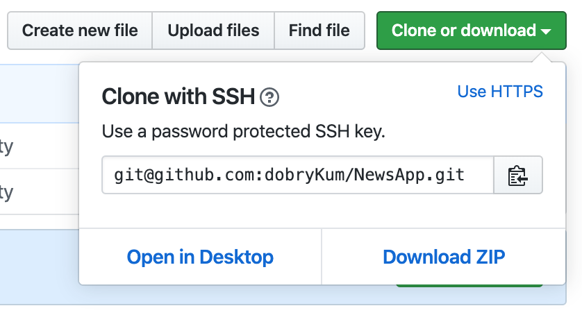
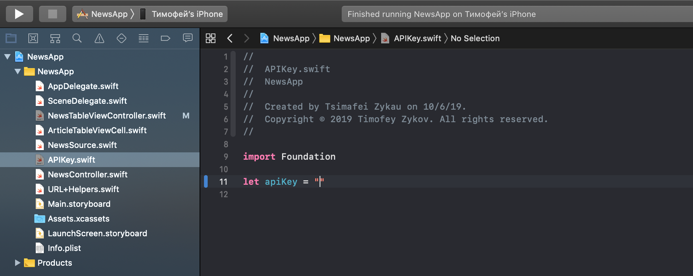
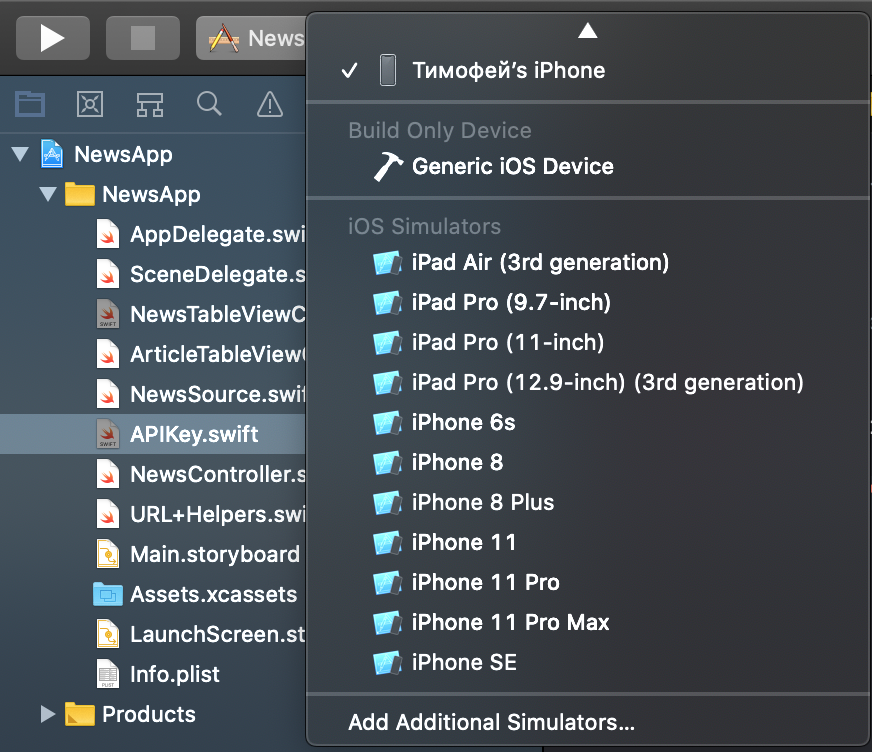

# NewsApp
Small Application working with NewsOrg API

## Setup Guide

1. Download *.zip* with project
    
2. Extract *.zip*, launch project and set apiKey constant at APIKey.swift file 
    
3. Launch project at your own device or simulator
    
